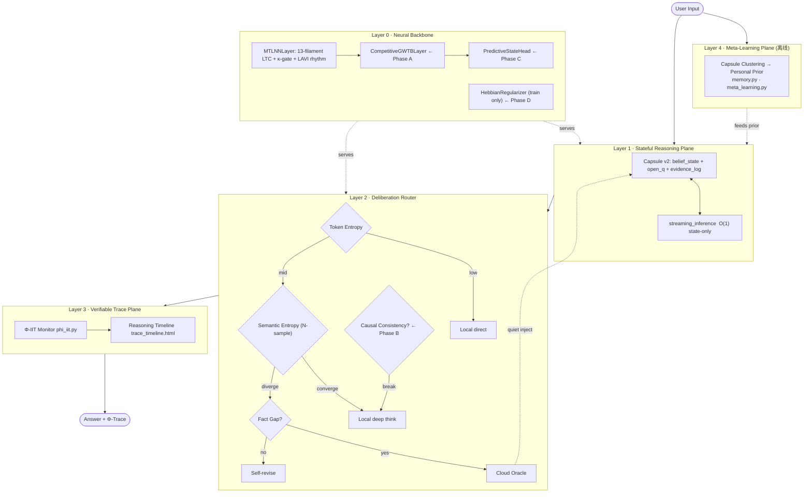

# AwareLiquid Architecture (v2.0 — MT-LNN Next)

**Last updated:** 2026-06-06
**Status:** Active development — v2.0 module expansion in progress
**Companion docs:** [PRD.md](PRD.md) · [AWARENESS_NETWORK_PRD.md](AWARENESS_NETWORK_PRD.md) · [AWARELIQUID_SYSTEM_MVP.md](AWARELIQUID_SYSTEM_MVP.md)

---

## 1. Design Thesis

巨头在云端拼参数广度。我们在**推理体验的三个维度**做差异化:

| 维度 | Gemini 3.1 | AwareLiquid |
|---|---|---|
| 思考状态 | 每次 query 后蒸发 | 跨 session 持续演化 (capsule) |
| 计算分配 | 一刀切 thinking budget | 按语义熵 + Φ 信号动态路由 |
| 推理可信度 | 黑盒摘要 | 可回放、可归因的 Φ-trace |

知识广度不打，**用云端 API 当事实硬盘**，核心推理与状态留在端侧。

v2.0 在此基础上增加四个正交模块，每个都有独立开关，默认关闭，零回归风险。

---

## 2. 完整模块地图 (v2.0)

```
mt_lnn/                                       STATUS        TEST FILE
├── config.py              MTLNNConfig         ✅ 已实现
├── embedding.py           RoPE + TokenEmbed   ✅ 已实现
├── mt_attention.py        GQA 极性注意力       ✅ 已实现
├── mt_lnn_layer.py        13原丝 LTC + 侧向耦合 ✅ 已实现      test_model.py
│   ├── (内含) κ-gate      动态τ尺度门           ✅ 已实现
│   └── (内含) _hebb_signal Hebbian 信号采集     ✅ Phase D
├── rhythm.py              LAVI节律门控          ✅ 2026-06-06  test_rhythm.py
│   ├── LAVIEstimator      per-protofilament 节律检测  (13测试)
│   └── GlobalRhythmController 跨层节律校正
├── gwtb.py                GWT 压缩→SA→广播     ✅ 已实现
│   └── CompetitiveGWTBLayer 多源竞争广播       ✅ Phase A     test_gwt_competition.py
├── global_coherence.py    sparse top-k Orch-OR  ✅ 已实现
├── causality.py           因果一致性检测         ✅ Phase B     test_causality.py
├── world_model.py         预测隐态头             ✅ Phase C     test_world_model.py
├── plasticity.py          Hebbian 正则           ✅ Phase D     test_plasticity.py
├── deliberation.py        熵三级路由 + causal hook ✅ 已实现    test_deliberation.py
├── thinking.py            自我思考 serve 路径     ✅ 已实现      test_thinking.py
│   ├── generate_with_thinking  路由驱动逐 token 生成 (模型无关)
│   ├── self_consistency_vote   SELF_CRITIQUE 重解码 (token 级自洽投票)
│   └── ThinkingTrace / render_*  内存思考轨迹 + 前端渲染
├── model.py               MTLNNModel (A-D集成)  ✅ 已实现      test_model.py
├── llama_adapter.py       HF 模型 MT 残差适配器  ✅ 已实现      test_llama_adapter.py
├── anesthesia.py          AVP 麻醉验证           ✅ 已实现
├── phi_hat.py             Φ̂ kNN 估算            ✅ 已实现
├── phi_iit.py             IIT 4.0 Φ (可选)      ✅ 已实现
├── memory.py              SQLite 持久 h_prev     ✅ 已实现      test_memory.py
├── capsule.py             信念状态 + 证据日志    ✅ 已实现      test_capsule_v2.py
├── streaming.py           state-only O(1) 推理   ✅ 已实现
├── recipes.py             Phase 5b 一键接入      ✅ 已实现
├── cloud_client.py        云端 Oracle 客户端     ✅ 已实现
├── observability.py       JSONL 指标写入         ✅ 已实现
├── reasoning_trace.py     推理时间线             ✅ 已实现
├── parallel_scan.py       pscan (Blelloch)       ✅ 已实现      test_parallel_scan.py
├── multimodal.py          视觉/任意模态前端       ✅ 已实现      test_multimodal.py
│   ├── VisionPatchEmbed   ViT patch → d_model token
│   ├── ModalityProjector  任意特征 → d_model token
│   └── CLIPModalityEncoder 冻结 CLIP → d_model token  test_multimodal_clip.py
├── spatial.py             空间计算前端 (栅格细胞)  ✅ 已实现      test_spatial.py
│   ├── GridCellEncoding   六边形/Fourier 位置码 (0参数, 固定)
│   ├── SpatialCoordEncoder 连续坐标(+特征) → d_model token
│   ├── PointCloudEncoder  PointNet 式点云 → d_model token
│   └── VoxelPatchEmbed    Conv3d 体素patch → d_model token
├── spatial_reasoning.py   空间思考 (感知+审议)     ✅ 已实现      test_spatial_reasoning.py
│   ├── SpatialReasoner     SpatialCoordEncoder + backbone + 路由
│   └── SpatialThinkingResult  逐空间位置 ThinkingTrace + uncertain_positions()
└── quantum_coupling.py    量子耦合 (可选)        ✅ 已实现
```

**模态前端契约 (multimodal.py / spatial.py)**: 所有前端统一产出 `(B, N, d_model)`
token,经 `fuse()` 与文本 token 拼接后由 `MTLNNModel.forward(inputs_embeds=...)`
进入 backbone。**这些模块从不 import model.py,与核心零耦合** —— 训练时与模型一同
放进 optimizer 即可。`spatial.py` 的 `GridCellEncoding` 是受内嗅皮层栅格细胞启发的
固定(0 参数)多尺度周期位置码,与正在跑的 `grid-cell-emergence` 实验同源。

**自我思考 serve 路径 (thinking.py)**: 把 `deliberation.py` 的*策略*（LOCAL /
SELF_CRITIQUE / CLOUD 三级路由）变成可在 demo 中逐 token 运行的*机制*。每步用
router 判定路由：低熵直接本地解码；不确定的 token 通过 token 级自洽投票
(`self_consistency_vote`) *重新斟酌*（这正是 `deliberation.py` 留下的
"Future: N-sample re-decode" 钩子）；需外部事实的 token 标记为 cloud。**仅 import
torch + deliberation,不碰 model.py** —— 适配 Qwen/Llama/MT-LNN `serve.pt`。在线
交互轨迹放内存 (`ThinkingTrace`),与 `reasoning_trace.py` 的离线 JSONL 持久化分工
明确。`app.py` 新增 "🧠 Self-Thinking" tab,可选导入失败则该 tab 自动隐藏（优雅降级）。

**空间思考 (spatial_reasoning.py)**: 把上面两块*收敛*成一个能力 —— 用
`SpatialCoordEncoder` 感知场景 (perception),再让 `deliberation.py` 的路由对
backbone *逐空间位置*的预测做审议 (deliberation)。`SpatialReasoner.reason()` 返回
一个 `ThinkingTrace`,其每一步对应一个空间 token:router 判 LOCAL（自信）/
SELF_CRITIQUE（重新斟酌）/ CLOUD（需外部事实），不确定位置触发自洽投票。
`uncertain_positions()` 即"模型在场景里何处停下来思考"的地图——这就是"空间思考"。
**只 import 公开 API**（`spatial` 编码器 / `multimodal.fuse` / `deliberation` 路由 /
`thinking` 轨迹）,通过 `forward(inputs_embeds=...) → out["logits"]` 契约触碰 backbone,
**无新增耦合**;它是 `nn.Module`,编码器可与模型联合训练,而 `reason()` 在 no_grad 下运行。

**Test coverage**: 321 tests in `tests/` (含 `test_spatial.py` 12 项空间前端测试、
`test_thinking.py` 10 项自我思考测试、`test_spatial_reasoning.py` 7 项空间思考测试)。

---

## 3. 层级架构 (five-layer view)



---

## 4. Layer 0 — Neural Backbone 组件详解

### 4.1 已完成组件

#### 微管 LTC 层 (`mt_lnn_layer.py`)
- 13 protofilaments × 5 τ时间尺度，完全向量化并行
- LateralCoupling: 静态W_lat + 近邻耦合 + RMC内容感知
- MAPGate: per-protofilament 稳定性门控
- GTP水解周期性重置: 长上下文不丢失侧向混合

#### κ-gate 动态计算跳过 (`mt_lnn_layer.py:VectorizedMultiScaleResonance`)
- 基于**当前输入内容**的 τ 尺度权重
- 回答: "现在在处理什么" → 选择激活哪些时间尺度
- 稀疏模式 (sparse_resonance_kernel=True): top-k 尺度计算跳过

#### LAVI 节律门控 (`rhythm.py`) — 2026-06-06 完成
- 基于 **h_prev vs 输入相似度** 的节律检测
- 回答: "状态有多稳定" → 持续/瞬态模式切换
- 高 LAVI → 慢 τ 主导 (上下文维持)
- 低 LAVI → 快 τ 主导 (快速适应)
- GlobalRhythmController: 跨层节律聚合 + GWTB 前残差校正

```
κ-gate (内容信号) ⊕ LAVI (历史信号) = 完整稳定性-灵活性权衡
```

#### GWTB — 全局工作区瓶颈 (`gwtb.py`)
- 压缩 d_model→d_gw → 工作区SA → 广播回 d_model
- broadcast_gate 初始化为 0.01: 从 identity 出发渐进学习
- 实现 Baars/Dehaene GWT 的容量约束 (bottleneck = 意识瓶颈)

#### GlobalCoherenceLayer (`global_coherence.py`)
- Sparse top-k 因果注意力 (保留最高10%分数)
- Orch-OR 坍缩门: 基于注意力能量的二值化
- 可选衰减工作记忆 (use_decay_wm=True): O(1) 空间复杂度

---

### 4.2 Phase A — CompetitiveGWTBLayer 🔨 进行中

**生物原型**: GWT 的核心主张是"意识内容"通过**竞争**决定——多个专用处理模块(视觉、记忆、语言、推理)同时向全局工作区"投标"，只有赢家的表示被全局广播。

**现状缺口**: 当前 `GWTBLayer` 将单条 `x` 流直接压缩，没有多源竞争。

**实现方案**:

```
CompetitiveGWTBLayer
  ├── 继承 GWTBLayer (退化路径，module_bids=None 时完全兼容)
  ├── 新增: ScoreHead — 对每个 bid 打分 (B,T,d_model) → (B,T,1)
  ├── 竞争: softmax(scores) 加权融合 bids → z_combined
  └── 广播: 走原有 compress→SA→broadcast 流程

module_bids 来源 (通过 MTLNNModel.forward 可选注入):
  - lnn_out       : 微管 LTC 隐态 (已有)
  - attn_out      : 多头注意力输出 (已有)
  - coherence_out : 全局相干信号 (已有)
  未来可扩展: world_model_pred / causal_signal
```

**Config 开关**: `use_competitive_gwtb: bool = False`
**触碰现有测试**: 零（默认 False）
**新增测试**: `tests/test_gwt_competition.py` (8+ 测试)

---

### 4.3 Phase B — CausalConsistencyChecker ✅ 已实现 (v2.1)

**生物原型**: 前额叶皮层对推理链进行持续的"预测误差"监测——当当前输出违背已建立的因果结构时，产生错误信号并触发重新评估。

**现状缺口**: `deliberation.py` 的路由只基于熵值，不检测生成内容是否与先前状态逻辑一致。

**注意**: 原方案建议接 Prolog/CaRing 推理引擎。**不采纳**。原因:
- Prolog 查询延迟 10-100ms，违反 I2 不变量 (<50ms/token)
- 触发频率 <1%，ROI 接近零
- 正确方案: 用已有的 h_prev 轨迹本身作为因果一致性信号

**实现方案**:

```python
# mt_lnn/causality.py
class CausalConsistencyChecker:
    """
    检测隐态轨迹中的因果断裂。
    
    原理: 正常因果链的 h_t 是 h_{t-1} 的平滑演化。
    断裂信号: 连续 window 步内 cosine_sim(h_t, h_{t-1}) < threshold
    
    接口: checker.update(h_prev) → consistency_score ∈ [0,1]
    集成: deliberation.py RouterDecision 增加 causal_consistency 字段
          consistency_score < 0.3 → 强制 SELF_CRITIQUE，无论熵值
    """
```

**deliberation.py 改动**: `RouteDecision` 新增可选字段，`decide()` 新增可选参数。完全向后兼容。

**v2.1 实现要点 — 两种 method**:

`CausalConsistencyChecker(window, ema_alpha, threshold, method="cosine"|"subspace", energy_keep=0.9)`。

- `method="cosine"` (默认，向后兼容): `unit_cosine_similarity(h_t, mean(window))` ∈ [0,1]。
- `method="subspace"` (各向异性鲁棒): 对 LLM 隐态而言，余弦相似度因 anisotropy（所有隐态共享一个主导方向）而饱和接近 1，对真实的因果断裂"失明"。子空间残差法先**用窗口均值中心化**（移除共享方向），对中心化窗口做 SVD，保留捕获 `energy_keep` 方差的前 k 个右奇异向量，把中心化的当前向量投影到该子空间，**子空间外的残差能量 = 新颖度**，`consistency = 1 - novelty`。实测：话题切换时 cosine delta ≈ 0.000（盲），subspace ≈ 0.414（min 0.172 越过 0.35 触发地板）。
- `effective_rank` 属性: `(Σλ)² / Σλ²`（participation ratio），表征当前表示维度，写入诊断 `causal_effective_rank`。
- `from_config(config, **overrides)` classmethod: 读取 `causal_check_*` 字段构造。
- 共享工具: cosine→[0,1] 仿射映射统一为 `utils.unit_cosine_similarity()`。

---

### 4.4 Phase C — PredictiveStateHead ✅ 已实现 (v2.1)

**生物原型**: 预测编码理论 (Friston Free Energy Principle) — 大脑持续预测下一时刻的感知状态，以预测误差驱动学习。现有 `VectorizedMultiScaleResonance.use_predictive_coding` 只在**τ尺度之间**预测（慢τ预测快τ），缺少 token 级别的前向预测。

**实现方案**:

```python
# mt_lnn/world_model.py
class PredictiveStateHead(nn.Module):
    """
    给定 h_t，预测 h_{t+1} 的嵌入向量。
    
    损失: MSE(W_pred · h_t, embed(x_{t+1}).detach())
    权重: config.world_model_loss_weight = 0.01 (极小，不影响LM loss)
    
    推理时附加功能:
    - 预测误差 pred_error_t 作为 LAVI 的补充输入
      (模型自己对下一步的预测是否准确 → 更精准的节律感知)
    - pred_error 写入 last_pred_error buffer (监控用)
    """
```

**与 rhythm.py 的联动**: PredictiveStateHead 的误差信号可以增强 LAVIEstimator — 当预测误差突增，也标志着瞬态模式应该启动。

**v2.1 实现要点 — BYOL/V-JEPA 自预测，防表示坍缩**:

朴素方案 `predict(h_t) → h_{t+1}.detach()` 让模型"预测自己"，会导致**表示坍缩**（所有输入映射到同一潜方向，pairwise|cos|→1，surprise 信号失去意义）。v2.1 改为 BYOL (arxiv 2006.07733) / V-JEPA (arxiv 2404.08471) 风格的非对称自蒸馏：

- `online_proj: Linear(d_model, proj_dim, bias=False)` + `predictor: [Linear→GELU→Linear]`（在线分支，可训练）。
- `target_proj: Linear(d_model, proj_dim, bias=False)`，`requires_grad=False`，由 online_proj 的 **EMA** 跟踪（`ema_decay=0.99`，stop-grad），并在 `warmup_steps` 内使用更温和的 decay（≤0.9）以避免早期目标过僵。
- 损失在**归一化潜向量**上：`residual = normalize(online) - normalize(target); loss = residual²·sum(-1).mean()`。
- **surprise 信号归一化到 [0,1]**: `last_pred_error = ((1 - cos) · 0.5).clamp(0,1)`，供 LAVI 稳定耦合（`wm_correction = tanh(pred_error_scale)·pred_error`）；同时保留原始 MSE 量级 `last_pred_error_raw` 供调试。
- 初始化顺序修复: 先初始化 online_proj (std=0.02)，再 copy 到 target_proj；predictor 用 small-init（非零）。

**科学发现 (见 V2_REVIEW.md §8)**: 实测发现 `use_ema_target=False` 分支（stop-grad + predictor + 无偏归一化投影）即 **SimSiam** (Chen & He 2021)，**本身就不坍缩**（3 seeds pairwise|cos|≈0.33）。即 EMA 对本架构的防坍缩**非必需**；EMA 在此规模下收敛速度≈SimSiam（非传言的 +25%）。`use_ema_target` 因此作为消融开关保留，默认 True。

---

### 4.5 Phase D — HebbianRegularizer ✅ 已实现 (v2.1)

**生物原型**: Hebb 法则 — "neurons that fire together, wire together"。激活模式相关的突触应当被巩固，减少灾难性遗忘。

**关于 STDP 的说明**: 原方案建议在 `mt_ltc_cell.py forward()` 里加 STDP。**不采纳**，原因:
- ProtofilamentLTC 的状态更新是连续时间衰减: `h_t = decay·h_{t-1} + (1-decay)·A_t`
- STDP 要求"突触前/后脉冲时序"，这在连续时间 LTC 里没有对应物
- 强行离散化会破坏 LTC 的核心动力学特性

**正确实现: Hebbian 损失项**（不改 forward，只改训练损失）:

```python
# mt_lnn/plasticity.py
class HebbianRegularizer(nn.Module):
    """
    Hebbian 正则项 (仅训练时启用):
    L_hebb = -α × mean(h_t ⊙ A_t)   # h=状态, A=输入投影, ⊙=逐元素乘
    
    当 h_t 与 A_t 同向时 (neurons fire together)，该项为负，
    加入总损失后鼓励这种共激活模式的权重被强化。
    
    LAVI 联动: α = base_lr × sigmoid(lavi_mean)
      - 持续模式 (高LAVI) → α 高 → 更强的记忆巩固
      - 瞬态模式 (低LAVI) → α 低 → 不在切换时过度巩固
    
    train.py 接入: total_loss += model.get_hebbian_loss()
    Config: use_hebbian=False (默认)，hebbian_lr=1e-4
    """
```

---

## 5. 数据流 (v2.0 增强版，单次 query)

```
User query
   ↓
[L1] prefill_state_only → 加载 capsule.belief_state (h_prev)
   ↓
[L0] per-token forward:
   MTLNNLayer (LTC + κ-gate + LAVI rhythm)
      ↓
   CompetitiveGWTBLayer (Phase A):
     bids = [lnn_out, attn_out, coherence_out]
     winner = softmax_competition(bids)
     broadcast(winner) → x
      ↓
   PredictiveStateHead (Phase C):
     pred_error = MSE(predict(h_t), h_{t+1})
     → LAVI 信号补充
   ↓
[L2] 每步 token → DeliberationRouter:
   ├─ CausalConsistencyChecker (Phase B):
   │    consistency = trajectory_smoothness(h_prev_window)
   │    if consistency < 0.3 → SELF_CRITIQUE
   ├─ 熵三级路由 (已有)
   └─ cloud inject (已有)
   ↓
[L3] 全程记录 (Φ, E, LAVI, causal_score, route_decision)
   ↓
[L1] capsule.save() ← belief + open_q + evidence
   ↓
Output: answer + reasoning timeline
```

---

## 6. 不变量 (Invariants)

| # | 不变量 | 守护机制 |
|---|---|---|
| I1 | Capsule ≤ 5KB | `capsule.py` 序列化大小断言 |
| I2 | 单 token 端侧延迟 < 50ms | L2 低熵路径不走 cloud；因果检测 <1ms (纯向量运算) |
| I3 | Φ 在生成全程可计算 | L3 与 L1 同步采样，不阻塞主 loop |
| I4 | 离线运行可用 | cloud router 失败必须 graceful degrade 到 self-critique |
| I5 | Evidence 可审计 | 每次 cloud inject 必须写 evidence_log |
| I6 | 新模块默认关闭 | 所有 Phase A-D 开关默认 False；零回归风险 |
| I7 | forward() 签名不变 | mt_lnn_layer.py forward / parallel_scan 不改签名 |

---

## 7. 耦合风险矩阵

```
                    config  mt_lnn_layer  gwtb    deliberation  model  train.py
─────────────────────────────────────────────────────────────────────────────────
Phase A GWT竞争      ✓(+2)              ✓扩展             ✓(+1)
Phase B 因果检测      ✓(+2)                      ✓(+1可选)  ✓(+1)
Phase C 预测头        ✓(+2)                                 ✓(+1)
Phase D Hebbian      ✓(+2)   ✓(读buffer)                         ✓(+1)
模态前端 spatial      —        —             —        —          —(仅用 inputs_embeds 入口)  —
─────────────────────────────────────────────────────────────────────────────────
风险等级:             低      极低          低      极低        低     低
```

所有改动都通过**可选参数 + 默认 False**实现，不破坏任何现有测试路径。

**`spatial.py` / `multimodal.py` 耦合 = 零**:这两个模块不触碰上表任何一列。它们
只依赖 backbone 早已稳定的 `forward(inputs_embeds=...)` 入口契约(产出 `(B,N,d_model)`
→ `fuse()` → 入模型),既不改 `config.py` 也不改 `model.py`,因此对训练路径无任何
风险。新增能力走"前端 + 融合"而非"改核心",是本仓库扩张模态能力的标准模式。

---

## 8. 取舍记录 (v2.0 新增)

### 为什么不接 Prolog/CaRing 推理引擎?
Prolog 查询延迟 10-100ms。在 token 生成路径里，这违反 I2 不变量。且触发频率 <1%，维护一个独立推理引擎的 ROI 接近零。正确方案是用 h_prev 轨迹本身作为因果信号（Phase B）。

### 为什么不在 forward() 里加 STDP?
ProtofilamentLTC 是连续时间 ODE，没有离散脉冲事件。STDP 的数学前提（突触前/后脉冲时序）在这里不存在。强行加入意味着把连续动力学离散化——破坏 LTC 的核心特性。正确方案是 Hebbian 损失项（Phase D）。

### 为什么不重新组织目录结构 (core/gwt/causality/)?
现有 40+ 文件按功能组织在 `mt_lnn/` 下，有完整的 import 路径。重组只是移文件，没有架构价值，还会破坏现有所有 import。

### 为什么不做内在情绪/价值系统?
没有可验证的神经科学对应实现，没有可量化的工程验收标准。3年以上的事情不在当前 roadmap。

---

## 9. 实施时间线

| Phase | 模块 | 关键文件 | 工作量 |
|---|---|---|---|
| ✅ 已完成 | LAVI节律门控 | `rhythm.py` | 完成 |
| ✅ A | CompetitiveGWTBLayer | `gwtb.py` (扩展) | 完成 |
| ✅ B | CausalConsistencyChecker (cosine + subspace) | `causality.py` + `deliberation.py` | 完成 (v2.1) |
| ✅ C | PredictiveStateHead (BYOL/V-JEPA EMA) | `world_model.py` + `model.py` | 完成 (v2.1) |
| ✅ D | HebbianRegularizer | `plasticity.py` + `train.py` | 完成 |
| ✅ 观测 | v2 模块 JSONL 指标 | `observability.py` (`v2_module_metrics`/`record_v2_metrics`) | 完成 (v2.1) |
| 🔲 E | 完整 125M 预训练 + A-D 验证 | 全栈 | 进行中 |

---

## 10. v2.0/v2.1 参数调优参考

所有开关默认 **False/关闭**，零回归。下表为已验证的安全默认与调优方向。

| Config 字段 | 默认 | 作用 | 调优提示 |
|---|---|---|---|
| `use_competitive_gwtb` | False | Phase A 多源竞争广播 | 开启后监控 `gwtb_competition_entropy`：→0 表示路由坍缩（某一源垄断），→log(K) 表示均匀；坍缩时降低 `gwtb_broadcast_init` |
| `gwtb_broadcast_init` | 0.01 | 门控残差初值 | 过大会早期主导主干，保持 ≤0.05 |
| `use_world_model` | False | Phase C 预测头 | 训练损失加 `world_model_loss_weight × L_wm` |
| `world_model_loss_weight` | 0.01 | 预测损失权重 | 极小以保证 LM loss 主导；>0.05 可能干扰语言建模 |
| `world_model_proj_ratio` | 0.5 | 潜投影维 / d_model | 更小→更强瓶颈、更省算力 |
| `world_model_ema_decay` | 0.99 | target_proj EMA 动量 | 大模型可调到 0.996–0.999；监控 `world_model_pred_error` 不应长期贴 0（坍缩）或贴 1（不学习） |
| `world_model_use_ema_target` | True | False=SimSiam 消融 | 实测两者均不坍缩；保留作对照 |
| `world_model_warmup_steps` | 1000 | EMA 温和期 | 与总步数同量级缩放 |
| `world_model_grad_clip` | 1.0 (train.py) | 预测头专属梯度裁剪 | 先于全局裁剪，防早期 surprise 爆梯度 |
| `use_hebbian` | False | Phase D 巩固正则 | 训练损失加 Hebbian 项；监控 `hebbian_signal_mean` |
| `hebbian_lr` | 1e-4 | 共激活权重 | 过大→过度巩固、灾难性偏置 |
| `hebbian_lavi_gate` | True | α 由 LAVI 门控 | 关闭则 α 恒定 |
| `causal_check_method` | "cosine" | Phase B 一致性度量 | LLM 隐态各向异性强时用 "subspace" |
| `causal_check_window` | 5 | 历史窗口 | subspace 法需 ≥2 才生效 |
| `causal_check_threshold` | 0.3 | 自我批判触发地板 | consistency < threshold → 强制 SELF_CRITIQUE |
| `global_rhythm` | False | 跨层节律聚合 | 监控 `global_rhythm_scale` |

**观测建议**: 预训练中每 100 步调用 `record_v2_metrics(writer, model, step, checker)`，所有标量写入 JSONL（`world_model_pred_error`、`gwtb_competition_entropy` 等均归一化到 [0,1] 或有界），便于离线绘制坍缩/路由健康曲线。
