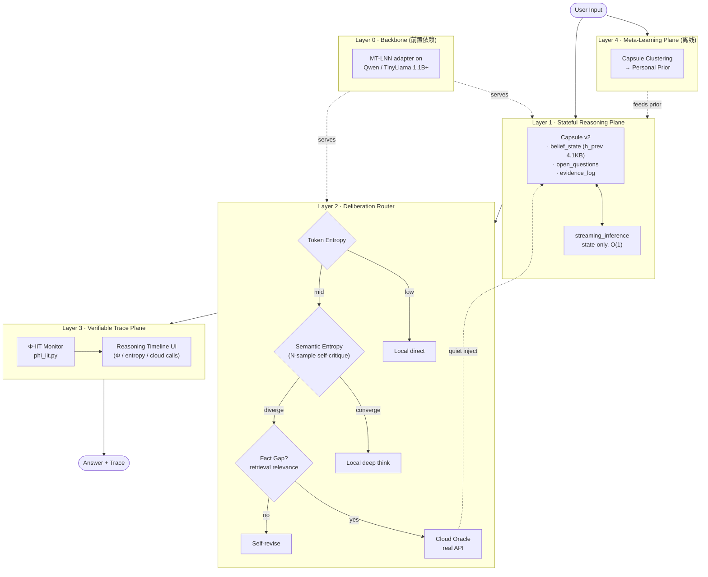

# AwareLiquid Architecture (v2.0)

**Last updated:** 2026-06-06
**Status:** Target architecture for "Reasoning UX > Gemini 3.1" milestone
**Companion docs:** [AWARENESS_NETWORK_PRD.md](AWARENESS_NETWORK_PRD.md) · [AWARELIQUID_SYSTEM_MVP.md](AWARELIQUID_SYSTEM_MVP.md)

---

## 1. Design Thesis

巨头在云端拼参数广度。我们在**推理体验的三个维度**做差异化:

| 维度 | Gemini 3.1 | AwareLiquid |
|---|---|---|
| 思考状态 | 每次 query 后蒸发 | 跨 session 持续演化 (capsule) |
| 计算分配 | 一刀切 thinking budget | 按语义熵 + Φ 信号动态路由 |
| 推理可信度 | 黑盒摘要 | 可回放、可归因的 Φ-trace |

知识广度不打,**用云端 API 当事实硬盘**,核心推理与状态留在端侧。

---

## 2. Layered Architecture



---

## 3. Layer Specs

### Layer 0 — Backbone (前置依赖,P0)
- **是什么**: 真正能产生连贯语言的解码器。当前 200K 参数 + vocab=200 仅用于算法验证。
- **目标**: 把 `train_llama_mt_adapter.py` 的 1.1B 适配器跑通,作为 L1 的状态承载体。
- **不到位的后果**: L1-L3 的所有差异化都失去意义。

#### Layer 0 子组件更新 (2026-06-06): EEG 节律门控

**新增**: `mt_lnn/rhythm.py` — LAVIEstimator + GlobalRhythmController

骨干层现在具备"节律感知":每个 MTLNNLayer 通过 LAVI(滞后角向量指数近似)实时感知推理状态是处于**持续模式**(高 LAVI,慢 τ 主导,上下文维持)还是**瞬态模式**(低 LAVI,快 τ 主导,快速切换)。

```
κ-gate (已有,基于当前内容)     →  回答"现在在处理什么"
LAVI rhythm gate (新增,基于历史) →  回答"状态有多稳定"
两者组合 → 更接近皮层在稳定性-灵活性之间的动态权衡
```

| 开关 | 描述 | 默认 |
|---|---|---|
| `use_rhythm=True` | 每层挂 LAVIEstimator, LAVI 调节 τ 尺度混合权重 | False (零影响) |
| `global_rhythm=True` | 在 GWTB 前增加 GlobalRhythmController 跨层校正 | False |

**不变量**: 默认关闭 (`use_rhythm=False`), 全部已有测试和 checkpoint 不受影响。

### Layer 1 — Stateful Reasoning Plane (已部分实现)
- **现状**: `mt_lnn/capsule.py` 已保存 4.1KB `h_prev`,`streaming.py` 已支持 state-only 生成。
- **升级 (Capsule v2)**: 单一 `h_prev` 升级为三段结构
  - `belief_state` — 现有 h_prev
  - `open_questions` — 高熵触发时入栈的未解决子问题
  - `evidence_log` — cloud inject 来源 + 时间戳 (审计用)
- **不可替代性**: Gemini 没有跨 session 持久推理状态。

### Layer 2 — Deliberation Router (已实现,Phase 7 ✅)
- **现状**: `mt_lnn/deliberation.py` 实现三级路由,`mt_lnn/cloud_client.py` 提供 env-var 驱动的后端工厂(Mock / Gemini / OpenAI,SDK 或 key 缺失时优雅降级)。
- **三级路由**:
  1. **低熵** (E < θ₁) → 本地直出
  2. **中熵** (θ₁ ≤ E < θ₂) → 可选 N-sample 语义熵自检 (semantic entropy)
  3. **高熵 + 事实缺口** → cloud API,quiet inject 进 L1
- **关键区分**: "事实缺口"用 `lexical_fact_gap()` 查 capsule.evidence_log 词级重叠;"推理困难"用语义熵收敛度。两者走不同分支。
- **不变量**: I4 由 `build_oracle_client()` 守护——任何配置错误都退回 `MockOracleClient`,管线绝不崩。

### Layer 3 — Verifiable Trace Plane (差异化护城河)
- **现状**: `mt_lnn/phi_iit.py` 已能算 Tononi Φ_max,但未接入生成 loop。
- **升级**: 每 N 步输出 `(token_range, Φ, entropy, cloud_calls)`,在 `ui.html` 渲染为推理时间线。
- **可被审计**: 哪段是本地深思 (Φ↑, E↓)、哪段是检索补脑、哪段是自我反驳——结构上 Gemini 复制不了。

### Layer 4 — Meta-Learning Plane (长期护城河)
- **现状**: `mt_lnn/memory.py` 有 SQLite 持久层。
- **升级**: 离线 job 把同主题 capsule 聚类,提取共有 belief,生成"用户专属先验"注入下次 prefill。
- **效果**: RAG-on-state (不是 RAG-on-text),用得越久越懂用户。

---

## 4. Data Flow (单次 query)

```
User query
   ↓
[L1] prefill_state_only → 加载 capsule.belief_state
   ↓
[L2] 每步 token → entropy check
   ├─ 低熵 ──────────────────────────────┐
   ├─ 中熵 → self-critique N rounds ─────┤
   └─ 高熵+缺口 → cloud API → quiet inject┤
                                          ↓
[L3] 全程记录 (Φ, E, route_decision) ─────┤
                                          ↓
[L1] capsule.save() ← belief + open_q + evidence
                                          ↓
Output: answer + reasoning timeline
```

---

## 5. 不变量 (Invariants)

| # | 不变量 | 守护机制 |
|---|---|---|
| I1 | Capsule ≤ 5KB | `capsule.py` 序列化大小断言 |
| I2 | 单 token 端侧延迟 < 50ms (1.1B) | L2 在低熵路径绝不走 cloud |
| I3 | Φ 在生成全程可计算 | L3 与 L1 同步采样,不阻塞主 loop |
| I4 | 离线运行可用 | cloud router 失败必须 graceful degrade 到 L2 self-critique |
| I5 | Evidence 可审计 | 每次 cloud inject 必须写 evidence_log |

---

## 6. 取舍记录

- **为什么不直接做 RAG?** RAG 是无状态的"查-拼-答";我们做的是"状态-推-补",capsule 是一等公民。
- **为什么 L0 不自研?** 训练 1B+ 骨干 ROI 远低于做 adapter。骨干换得起,L1-L4 才是护城河。
- **为什么 Φ 不替代 entropy?** Φ 计算贵 (PyPhi,O(2^n)),只能稀疏采样;entropy 廉价,做 per-token 路由。两者互补。
