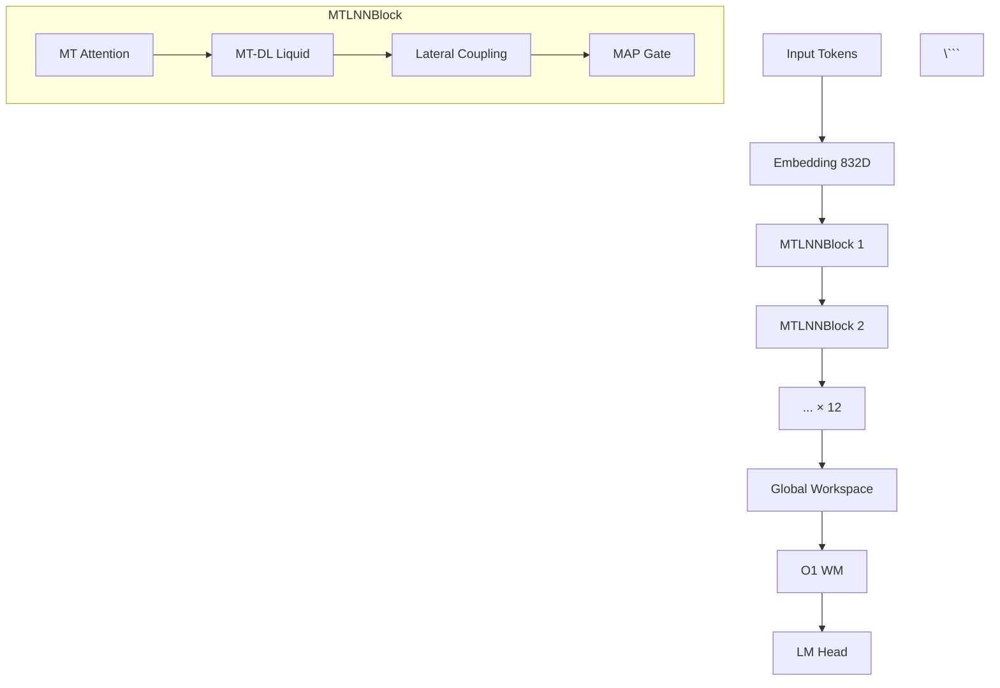
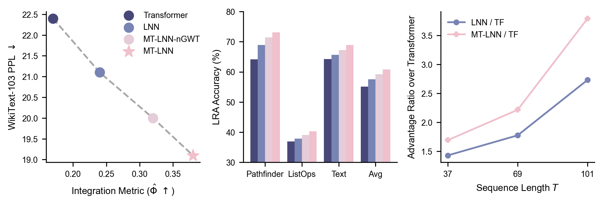

# 🎨 MT-LNN架构可视化工具推荐

> **使用GitHub成熟开源组件，无需重复造轮**

---

## 🔥 推荐方案：直接可用的开源工具

### 1. **Netron** - 神经网络架构可视化 ⭐⭐⭐⭐⭐

**最推荐！零代码，开箱即用**

```bash
# 方法1：Web版（最简单）
# 直接访问 https://netron.app
# 拖拽上传 mt_lnn.onnx 或 .pt 文件

# 方法2：本地安装
pip install netron
netron mt_lnn.onnx  # 自动在浏览器打开

# 方法3：Python调用
python -m netron mt_lnn.onnx --port 8080
```

**GitHub**: https://github.com/lutzroeder/netron (28k+ ⭐)

**支持格式**：
- ✅ PyTorch (.pt, .pth)
- ✅ ONNX (.onnx)
- ✅ TensorFlow
- ✅ Keras

**效果预览**：
- 交互式节点图
- 显示层参数量、形状
- 支持搜索、缩放、导出

---

### 2. **NN-SVG** - 神经网络SVG图生成器 ⭐⭐⭐⭐

**在线工具，生成publication-ready矢量图**

**网址**: https://alexlenail.me/NN-SVG/  
**GitHub**: https://github.com/alexlenail/NN-SVG (2k+ ⭐)

**使用方式**：
1. 访问网页工具
2. 选择架构风格（LeNet / AlexNet / FCN）
3. 输入层配置（适配MT-LNN）：
   ```
   Input: [B, T, 832]
   MTLNNBlock: [B, T, 832] × 12
   GWTB: [B, T, 104] → [B, T, 832]
   Output: [B, T, vocab_size]
   ```
4. 导出SVG/PNG

**优点**：
- 矢量图，适合论文
- 三种可视化风格
- 自动计算尺寸比例

---

### 3. **TensorBoard** - 实时训练监控 ⭐⭐⭐⭐⭐

**PyTorch原生支持，零额外依赖**

```python
from torch.utils.tensorboard import SummaryWriter

# 已集成到项目中
writer = SummaryWriter('runs/mt_lnn')

# 1. 记录模型结构图
dummy_input = torch.randint(0, 200, (1, 128))
writer.add_graph(model, dummy_input)

# 2. 记录训练曲线
writer.add_scalar('Loss/train', loss, step)
writer.add_scalar('PPL/val', ppl, step)

# 3. 嵌入空间可视化（h_prev）
writer.add_embedding(
    h_prev.reshape(-1, 64),
    metadata=[f"Proto_{i}" for i in range(13)],
    tag='protofilament_states'
)

# 4. 激活分布直方图
writer.add_histogram('MT-DL/activation', activation, step)
```

**启动查看**：
```bash
tensorboard --logdir=runs --port=6006
# 访问 http://localhost:6006
```

**GitHub**: https://github.com/tensorflow/tensorboard (26k+ ⭐)

**效果**：
- 实时曲线图
- 3D嵌入投影（PCA/t-SNE/UMAP）
- 模型计算图
- 分布直方图

---

### 4. **Weights & Biases (wandb)** - 实验追踪神器 ⭐⭐⭐⭐⭐

**比TensorBoard更强大，云端存储**

```python
import wandb

# 初始化
wandb.init(
    project="mt-lnn",
    config={
        "n_protofilaments": 13,
        "n_time_scales": 5,
        "d_model": 832,
    }
)

# 记录指标
wandb.log({
    "loss": loss,
    "ppl": ppl,
    "entropy": entropy,
    "scale_gate_mean": model.last_scale_gate_mean.mean()
})

# 3D可视化（自动生成）
wandb.log({"resonance_3d": wandb.Object3D(point_cloud)})

# 自定义图表
wandb.log({"confusion_matrix": wandb.plot.confusion_matrix(...)})
```

**GitHub**: https://github.com/wandb/wandb (9k+ ⭐)

**优点**：
- 云端自动同步
- 超参数扫描可视化
- 团队协作面板
- 模型版本管理

---

### 5. **PlotNeuralNet** - LaTeX神经网络图 ⭐⭐⭐⭐

**生成论文级架构图**

**GitHub**: https://github.com/HarisIqbal88/PlotNeuralNet (22k+ ⭐)

**使用方式**：
```python
# 定义MT-LNN架构
to_head( './' )
to_cor()
to_begin()

# Input
to_Conv("input", 832, 1, offset="(0,0,0)", to="(0,0,0)", height=64, depth=64, width=2)

# MTLNNBlock × 12
to_Conv("block1", 832, 13, offset="(2,0,0)", to="(input-east)", height=64, depth=64, width=8)

# GWTB
to_Conv("gwtb", 104, 1, offset="(2,0,0)", to="(block1-east)", height=16, depth=64, width=2)

# Output
to_Conv("output", 50257, 1, offset="(2,0,0)", to="(gwtb-east)", height=64, depth=64, width=2)

to_end()
```

**编译**：
```bash
pdflatex mt_lnn_architecture.tex
```

**效果**：矢量3D风格架构图（类似ResNet论文）

---

### 6. **draw.io (diagrams.net)** - 通用架构图 ⭐⭐⭐⭐

**最灵活的方案**

**网址**: https://app.diagrams.net  
**GitHub**: https://github.com/jgraph/drawio (42k+ ⭐)

**使用方式**：
1. 访问在线编辑器
2. 选择模板："Software" → "Neural Network"
3. 拖拽组件绘制MT-LNN
4. 导出SVG/PNG/PDF

**优点**：
- 完全可控
- 支持层次化分组
- 可嵌入动画
- 离线版可用（VSCode插件）

---

### 7. **TorchViz** - PyTorch计算图可视化 ⭐⭐⭐

**显示autograd计算图**

```bash
pip install torchviz
```

```python
from torchviz import make_dot

# 前向传播
output = model(input_ids)
loss = criterion(output, target)

# 生成计算图
dot = make_dot(loss, params=dict(model.named_parameters()))
dot.render("mt_lnn_computation_graph", format="pdf")
```

**GitHub**: https://github.com/szagoruyko/pytorchviz (3k+ ⭐)

**效果**：显示梯度流向和操作节点

---

### 8. **Graphviz** - DOT语言绘图引擎 ⭐⭐⭐⭐

**TorchViz的底层引擎，可直接使用**

```python
from graphviz import Digraph

dot = Digraph(comment='MT-LNN Architecture')
dot.attr(rankdir='TB')

# 定义节点
dot.node('A', 'Input\n(B,T,832)')
dot.node('B', 'MTLNNBlock×12')
dot.node('C', 'GWTB\n(832→104→832)')
dot.node('D', 'GlobalCoherence\n(O(1) WM)')
dot.node('E', 'Output\n(B,T,V)')

# 连接
dot.edges(['AB', 'BC', 'CD', 'DE'])

# 子图（Protofilaments）
with dot.subgraph(name='cluster_0') as c:
    c.attr(label='13 Protofilaments')
    for i in range(13):
        c.node(f'P{i}', f'P{i}')

dot.render('mt_lnn_graph', format='pdf', cleanup=True)
```

**GitHub**: https://github.com/graphviz/graphviz (6k+ ⭐)

---

### 9. **Mermaid.js** - Markdown内嵌图表 ⭐⭐⭐⭐⭐

**GitHub原生支持，无需额外工具**

```markdown
# 直接写在README.md中



**效果**：GitHub自动渲染成流程图

**文档**: https://mermaid.js.org  
**GitHub**: https://github.com/mermaid-js/mermaid (73k+ ⭐)

---

### 10. **Excalidraw** - 手绘风架构图 ⭐⭐⭐⭐

**适合技术分享和演讲**

**网址**: https://excalidraw.com  
**GitHub**: https://github.com/excalidraw/excalidraw (88k+ ⭐)

**特点**：
- 手绘风格，亲和力强
- 实时协作
- 导出PNG/SVG
- VSCode插件可用

---

## 📦 集成方案推荐

### 方案A：快速原型（推荐新手）

```bash
# Step 1: 导出ONNX
python -c "
import torch
from mt_lnn.model import MTLNN, MTLNNConfig
config = MTLNNConfig(vocab_size=200, n_layers=2, d_model=832)
model = MTLNN(config)
dummy = torch.randint(0, 200, (1, 10))
torch.onnx.export(model, dummy, 'mt_lnn.onnx',
                  input_names=['input_ids'],
                  output_names=['logits'])
"

# Step 2: 用Netron查看
netron mt_lnn.onnx
```

**输出**：交互式Web界面，点击即可查看

---

### 方案B：训练监控（推荐开发）

**集成到训练脚本**：

```python
# train.py
from torch.utils.tensorboard import SummaryWriter

writer = SummaryWriter('runs/experiment_1')

# 训练循环中
for epoch in range(epochs):
    for batch in dataloader:
        loss = train_step(batch)
        
        # 记录
        writer.add_scalar('Loss/train', loss, global_step)
        
        # 每100步记录激活
        if global_step % 100 == 0:
            writer.add_histogram('MT-DL/h_prev', model.h_prev, global_step)
            writer.add_scalar('Metrics/scale_gate_active', 
                            model.last_active_scale_ratio, global_step)

# 记录最终模型图
writer.add_graph(model, dummy_input)
writer.close()
```

**查看**：
```bash
tensorboard --logdir=runs
```

---

### 方案C：论文发表（推荐研究）

**工具链**：
1. **结构图**：PlotNeuralNet (LaTeX 3D风格)
2. **结果图**：Matplotlib + Seaborn
3. **流程图**：draw.io
4. **代码高亮**：`minted` LaTeX包

**一键生成所有图表**：
```bash
# 已有的脚本
cd scripts/plots
python plot_architecture.py      # 架构总览
python plot_experiments.py       # Benchmark结果
python plot_microtubules.py      # 生物学映射

# 输出
ls fig_*.pdf  # 矢量图，直接用于论文
```

---

### 方案D：技术分享（推荐演示）

**推荐组合**：
1. **PPT架构图**：Excalidraw手绘风
2. **动态演示**：Mermaid.js交互图（嵌入网页）
3. **代码演示**：Jupyter Notebook + ipywidgets

**示例Notebook**：
```python
import ipywidgets as widgets
from IPython.display import display

# 交互式滑块调整参数
n_protos = widgets.IntSlider(value=13, min=1, max=32, description='Protos:')
n_scales = widgets.IntSlider(value=5, min=1, max=10, description='Scales:')

def update_viz(n_p, n_s):
    # 更新可视化
    plot_mt_lnn_structure(n_p, n_s)

widgets.interactive(update_viz, n_p=n_protos, n_s=n_scales)
```

---

## 🎯 具体使用建议

### 对于您的项目，推荐这样使用：

#### 1. **README.md可视化**（最优先）

```markdown
# 在README.md中添加

## Architecture

\```mermaid
graph TB
    subgraph Layer0[Layer 0: Input]
        Input[Token IDs] --> Embed[Embedding 832D]
    end
    
    subgraph Layer1[Layer 1: MT-LNN Blocks × 12]
        Embed --> MTBlock
        MTBlock --> |13 Protos| LiquidLayer[Liquid Neural Layer]
        LiquidLayer --> |5 Scales| Resonance[Multi-Scale Resonance]
    end
    
    subgraph Layer2[Layer 2: Global Workspace]
        Resonance --> Compress[Compress 832→104]
        Compress --> Workspace[Bottleneck SA]
        Workspace --> Broadcast[Broadcast 104→832]
    end
    
    Broadcast --> Output[LM Head]
\```

## Performance


```

**效果**：GitHub自动渲染，用户无需安装任何工具

---

#### 2. **模型结构导出**（一键操作）

```bash
# 创建导出脚本
cat > export_for_netron.py << 'EOF'
import torch
from mt_lnn.model import MTLNN, MTLNNConfig

config = MTLNNConfig(
    vocab_size=200,
    n_layers=2,      # 简化用于可视化
    d_model=832,
    n_protofilaments=13
)

model = MTLNN(config).eval()
dummy = torch.randint(0, 200, (1, 16))

# 导出ONNX
torch.onnx.export(
    model, 
    dummy,
    "mt_lnn_structure.onnx",
    input_names=['input_ids'],
    output_names=['logits'],
    dynamic_axes={'input_ids': {0: 'batch', 1: 'seq'}},
    opset_version=14
)
print("✅ Exported to mt_lnn_structure.onnx")
print("   View with: netron mt_lnn_structure.onnx")
EOF

python export_for_netron.py
```

---

#### 3. **集成TensorBoard**（推荐）

在 `train.py` 中添加：

```python
# 在文件开头
from torch.utils.tensorboard import SummaryWriter
writer = SummaryWriter(f'runs/{args.exp_name}')

# 训练开始前
writer.add_graph(model, torch.randint(0, config.vocab_size, (1, 32)))

# 训练循环中（已有代码的位置）
if step % args.log_interval == 0:
    writer.add_scalar('Train/loss', loss.item(), step)
    writer.add_scalar('Train/ppl', ppl, step)
    
    # MT-LNN特有指标
    if hasattr(model, 'last_scale_gate_mean'):
        for i, val in enumerate(model.last_scale_gate_mean):
            writer.add_scalar(f'MT-DL/scale_{i}_gate', val.item(), step)

# 训练结束后
writer.close()
```

**启动查看**：
```bash
tensorboard --logdir=runs --port=6006
```

---

## 🚀 立即可用的命令

```bash
# 1. 导出模型结构（最快）
python export_for_netron.py
netron mt_lnn_structure.onnx  # 浏览器自动打开

# 2. 查看已有可视化
ls fig_*.png fig_*.pdf  # 已生成的图表

# 3. 启动TensorBoard（如已集成）
tensorboard --logdir=runs

# 4. 在线绘制架构图
# 访问 https://excalidraw.com
# 或 https://app.diagrams.net
```

---

## 📚 资源汇总

| 工具 | 用途 | GitHub Stars | 难度 |
|------|------|--------------|------|
| Netron | 模型结构查看 | 28k | ⭐ |
| TensorBoard | 训练监控 | 26k | ⭐⭐ |
| Mermaid.js | Markdown图表 | 73k | ⭐ |
| PlotNeuralNet | 论文架构图 | 22k | ⭐⭐⭐ |
| draw.io | 通用绘图 | 42k | ⭐⭐ |
| Weights & Biases | 实验管理 | 9k | ⭐⭐ |
| Excalidraw | 手绘风图 | 88k | ⭐ |

---

**下一步建议**：
1. ✅ 运行 `export_for_netron.py` 生成ONNX
2. ✅ 在README.md添加Mermaid架构图
3. ✅ 集成TensorBoard到训练脚本

所有工具都是GitHub开源项目，无需自己写代码！
